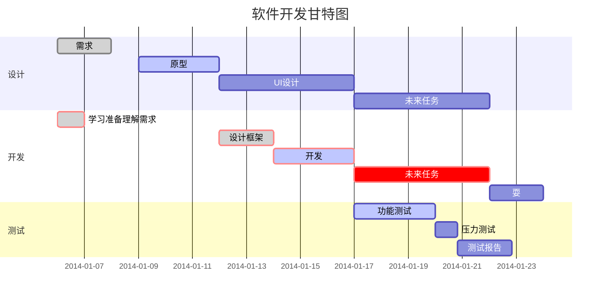
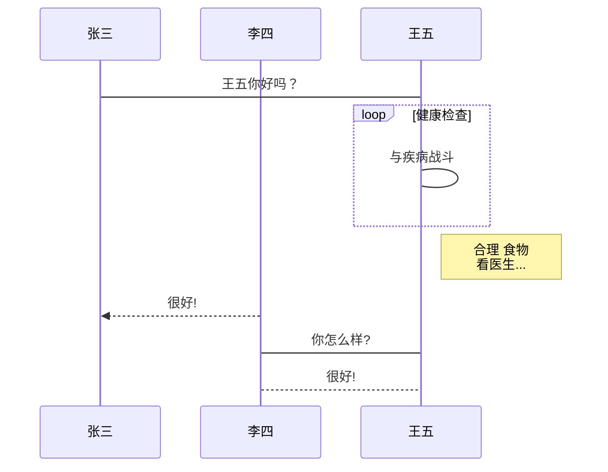

# Hello World

## KaTeX数学公式

您可以使用渲染LaTeX数学表达式 [KaTeX](https://khan.github.io/KaTeX/):

Gamma公式展示 $\Gamma(n) = (n-1)!\quad\forall
n\in\mathbb N$ 是通过欧拉积分

$$
\Gamma(z) = \int_0^\infty t^{z-1}e^{-t}dt\,.
$$

> 你可以找到更多关于的信息 **LaTeX** 数学表达式[here][1].


## 作业

**作业 5.** 设函数 $f:\mathbb{R}^n \to \mathbb{R}$连续二次可微，$\{x^k\}$ 由某下降算法生成（即 $d^k$ 为下降方向），$\alpha_k$ 由Wolfe-Powell原则生成。已知   $x^k \to x^*$，并且 $\nabla f(x^*)=0,\nabla^2f(x^*)>0$。令
$$
\delta_k := \frac{\Vert\nabla f(x^k)+\nabla^2f(x^k)d^k\Vert}{\Vert d^k \Vert}
$$
如果 $\delta_k \to 0$，证明下述结论成立：
$\space$（1）当 $k$ 充分大时，必有步长 $\alpha_k=1;$
$\space$（2）序列 $\{x^k\}$ 超线性收敛。
> 解答：（1）



```sequence
对象A->对象B: 对象B你好吗?（请求）
Note right of 对象B: 对象B的描述
Note left of 对象A: 对象A的描述(提示)
对象B-->对象A: 我很好(响应)
对象A->对象B: 你真的好吗？
```

```flow
st=>start: 开始框
op=>operation: 处理框
cond=>condition: 判断框(是或否?)
sub1=>subroutine: 子流程
io=>inputoutput: 输入输出框
e=>end: 结束框
st->op->cond
cond(yes)->io->e
cond(no)->sub1(right)->op
```

```flow
st=>start: 开始框
op=>operation: 处理框
cond=>condition: 判断框(是或否?)
sub1=>subroutine: 子流程
io=>inputoutput: 输入输出框
e=>end: 结束框
st(right)->op(right)->cond
cond(yes)->io(bottom)->e
cond(no)->sub1(right)->op
```

```sequence
Title: 标题：复杂使用
对象A->对象B: 对象B你好吗?（请求）
Note right of 对象B: 对象B的描述
Note left of 对象A: 对象A的描述(提示)
对象B-->对象A: 我很好(响应)
对象B->小三: 你好吗
小三-->>对象A: 对象B找我了
对象A->对象B: 你真的好吗？
Note over 小三,对象B: 我们是朋友
participant C
Note right of C: 没人陪我玩
```



